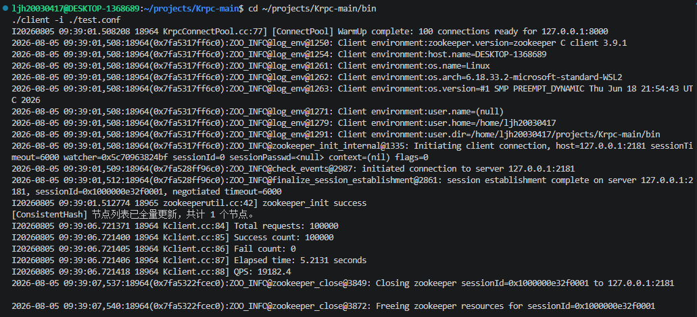
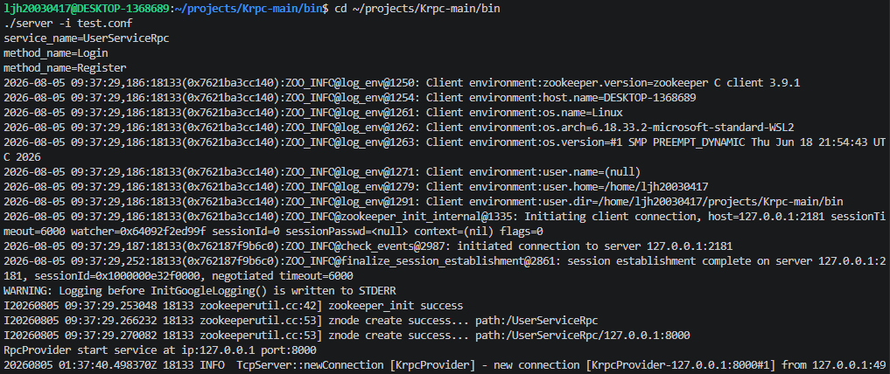

# RPC-main
这是一个基于C++的分布式RPC服务系统

## 客户端运行结果

## 服务端运行结果

##
本项目在 WSL Ubuntu 24.04 中的环境搭建、编译与运行流程

一、安装 WSL 2

首先在 Windows的CMD或PowerShell中安装 WSL：

wsl --install

安装完成后检查：

wsl -l -v

最开始系统提示：适用于Linux的Windows子系统没有已安装的分发。这表示WSL本身已经安装，但还没有安装Ubuntu等Linux发行版。
查看可以安装的发行版：

wsl --list --online

安装 Ubuntu 24.04：

wsl --install -d Ubuntu-24.04

安装完成后启动：

wsl -d Ubuntu-24.04
##
二、创建用户

Ubuntu 第一次启动时要求创建Linux用户。注意事项：Linux 用户名不能以数字开头、设置用户密码时，终端不会显示字符或星号，这是正常现象。

##
三、更新Ubuntu并安装基础C++编译环境

进入 Ubuntu 后先更新软件包：

sudo apt update

sudo apt upgrade -y

安装 C++ 编译和调试工具：

sudo apt install -y \
  build-essential \ gdb \ git \ curl \ wget \ unzip
  
其中：

gcc：C 编译器

g++：C++ 编译器

make：构建工具

gdb：调试器

git：代码版本管理工具

检查安装：

g++ --version

gcc --version

make --version

gdb --version
##
四、安装 CMake、Ninja 和 pkg-config

执行：

sudo apt install -y cmake ninja-build pkg-config

检查版本：

cmake --version

ninja --version

pkg-config --version

##
五、将Windows项目（假设在D盘）复制到 WSL

Windows中的项目路径是：D:\Krpc-main

创建 Linux 项目目录：

mkdir -p ~/projects

复制项目：
cp -a "/mnt/d/Krpc-main" ~/projects/

进入项目：

cd ~/projects/Krpc-main

##
六、安装本项目所用的Protobuf、Muduo、glog和ZooKeeper开发库

1、安装Protobuf命令：

sudo apt install -y \ protobuf-compiler \ libprotobuf-dev \ libprotoc-dev

2、安装Muduo命令：

(1)先安装Muduo所需依赖：sudo apt install -y \ git \ build-essential \ cmake \ make \ libboost-dev

(2)创建第三方库目录：

mkdir -p ~/libs

cd ~/libs

(3)下载 Muduo：
git clone https://github.com/chenshuo/muduo.git

cd muduo

(4)编译 Muduo：

cmake -S . -B build \
  -DCMAKE_BUILD_TYPE=Release \
  -DCMAKE_INSTALL_PREFIX=/usr/local
  
cmake --build build -j$(nproc)

(5)安装：

sudo cmake --install build

sudo ldconfig

3、安装glog和ZooKeeper 开发库命令：

sudo apt install -y \ libgoogle-glog-dev \ libgflags-dev

sudo apt install -y libzookeeper-mt-dev

sudo apt install -y zookeeperd zookeeper-bin

##
七、编译项目

cd ~/projects/Krpc-main

rm -rf build

配置：

cmake -S . -B build -DCMAKE_BUILD_TYPE=Debug

编译：

cmake --build build -j$(nproc)

##

八、如果你下的是最新版本的Protobuf，那么本项目中./src/Krpcheader.proto和./example/user.proto生成的.pb.cc和.pb.h不适用，需要重新生成：
先创建临时输出目录：

rm -rf /tmp/krpc_pb

mkdir -p /tmp/krpc_pb

使用当前版本的 protoc 重新生成：

protoc \
  -I=src \
  --cpp_out=/tmp/krpc_pb \
  src/Krpcheader.proto
  
生成：

/tmp/krpc_pb/Krpcheader.pb.cc

/tmp/krpc_pb/Krpcheader.pb.h

备份旧文件：

cp src/Krpcheader.pb.cc \
   src/Krpcheader.pb.cc.bak
   
cp src/include/Krpcheader.pb.h \
   src/include/Krpcheader.pb.h.bak
  
替换旧文件：

cp /tmp/krpc_pb/Krpcheader.pb.cc \
   src/Krpcheader.pb.cc
   
cp /tmp/krpc_pb/Krpcheader.pb.h \
   src/include/Krpcheader.pb.h
   
##
九、根据新版 Protobuf 重新生成 user.pb.cc 和 user.pb.h：

protoc \ -I=example \ --cpp_out=example \ example/user.proto

##
十、编译核心库

重新清理并构建：

cd ~/projects/Krpc-main

rm -rf build

cmake -S . -B build \
  -DCMAKE_BUILD_TYPE=Debug
  
cmake --build build -j$(nproc)

##
十一、运行服务端

cd ~/projects/Krpc-main/bin

执行：./server -i ./test.conf

##
十二、运行客户端

cd ~/projects/Krpc-main/bin

./client -i ./test.conf
